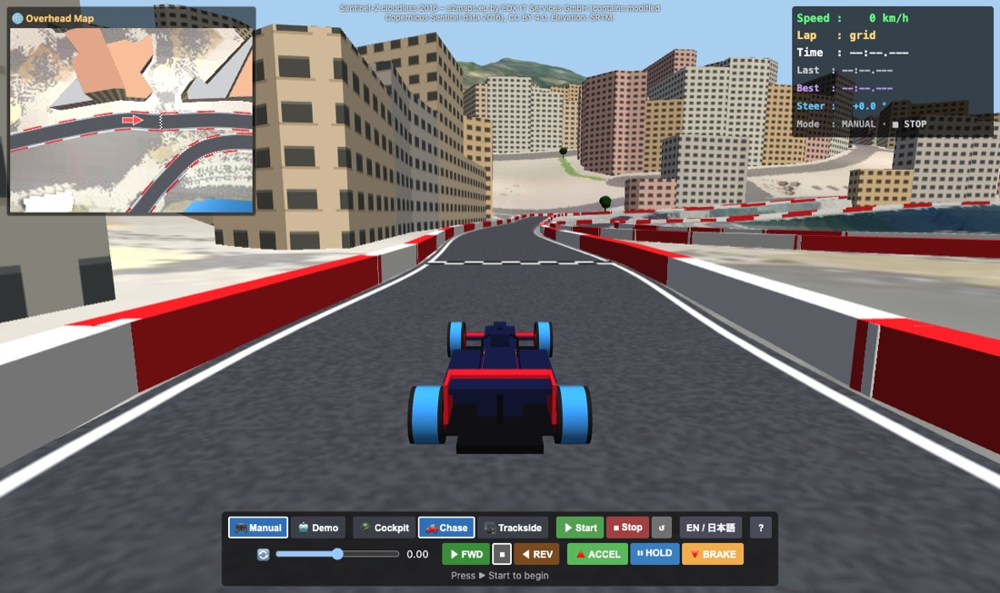
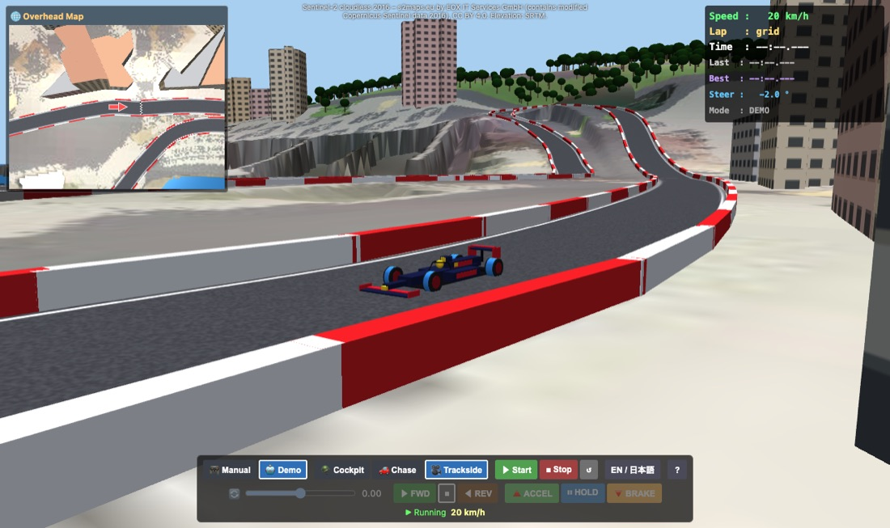
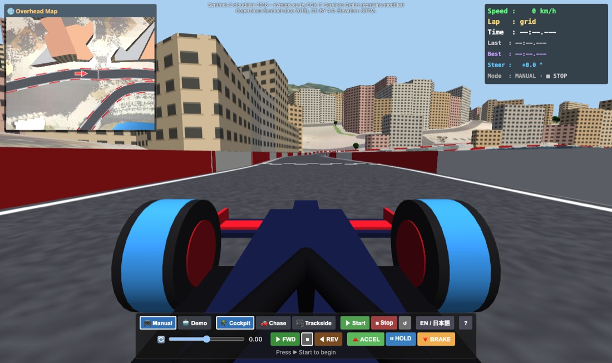

# Monaco Street Circuit – User Manual

Drive an F1-style car around the Circuit de Monaco, or sit back and let the demo driver take a lap.
The car's physics comes from the MuJoCo physics engine, running in your browser and desktop environment.

---

## 📑 Table of Contents

1. [Quick Start](#1-quick-start)
2. [The Screen Layout](#2-the-screen-layout)
3. [Driving it Yourself (Manual Mode)](#3-driving-it-yourself-manual-mode)
4. [Demo Mode](#4-demo-mode)
5. [Cameras](#5-cameras)
6. [Lap Timing](#6-lap-timing)
7. [Warnings and Sound](#7-warnings-and-sound)
8. [Keyboard Shortcuts](#8-keyboard-shortcuts)
9. [Link & URL Options](#9-link--url-options)
10. [Troubleshooting](#10-troubleshooting)
11. [Map Data and Credits](#11-map-data-and-credits)

---

## 1. Quick Start

### 🤖 Just watch a lap
1. Wait until the status line under the buttons says *Press ▶ Start to begin*.
2. Click **🤖 Demo**, then click **▶ Start**.
3. Try switching between the three cameras: **🪖 Cockpit**, **🚗 Chase**, and **🎥 Trackside**.

### 🎮 Drive it yourself
1. Make sure **🎮 Manual** is selected, then click **▶ Start**.
2. Click **▶ FWD** to pick the forward direction. (The car does not move until you choose a direction).
3. Click **🔺 ACCEL** to speed up. It stays accelerating until you press another pedal.
4. Steer with the slider or the <kbd>←</kbd> / <kbd>→</kbd> keys. Use **🔻 BRAKE** before corners and **⏸ HOLD** to keep your current cruising speed.

---

## 2. The Screen Layout

| Area | Description |
|---|---|
| **Main View** | Fills the window. Shows whichever camera perspective you selected. |
| **Overhead Map (Top-Left)** | Birds-eye view of the area around the car from 150 m above. The red arrow is your car. |
| **HUD (Top-Right)** | Displays speed, lap number, current / last / best lap time, active steering angle sent to wheels, and driving mode. In Manual mode, it also shows active direction and pedal. |
| **Credit (Top-Center)** | Source attribution for the satellite imagery and elevation data. |
| **Control Bar (Bottom)** | **Top row**: Mode, camera, Start / Stop / Reset, language switch, **?** (User manual). **Bottom row**: Manual driving controls (greyed out in Demo mode). **Status line**: Displays real-time simulation state. |

---

## 3. Driving it Yourself (Manual Mode)

### Direction Controls

| Button | Effect |
|---|---|
| **▶ FWD** | Drive forwards, up to 300 km/h. |
| **■** | Stop. With no pedal pressed, the car brakes to a standstill. |
| **◀ REV** | Reverse, up to about 30 km/h. Handy for backing off a barrier. |

### Pedals

You can have only one pedal active at a time. Pressing another pedal switches to it, and pressing the currently active pedal releases it (coasting).

| Pedal | Effect |
|---|---|
| **🔺 ACCEL** | Accelerates in the chosen direction (0–100 km/h in approx. 3 seconds). |
| **⏸ HOLD** | Cruise control: maintains your current speed. |
| **🔻 BRAKE** | Decelerates smoothly down to a complete stop. |
| **(none)** | The car coasts freely and gradually loses speed due to rolling resistance and air drag. |

### Steering & Speed Sensitivity

- Drag the 🔄 slider, or press <kbd>←</kbd> / <kbd>→</kbd> to steer step-by-step.
- Press <kbd>C</kbd> to center steering instantly.
- The slider remains where you leave it, so remember to straighten up after exiting a turn.

> [!NOTE]
> **Speed-Sensitive Steering**: At higher speeds, the front wheel angle is automatically limited to prevent high-speed spinouts.
> - At 100 km/h: ~40% of steering authority
> - At 200 km/h: ~15% of steering authority
> - Near top speed (300 km/h): <10% authority
> **Pro Tip**: Always **brake before the corner**, turn during entry, then accelerate upon exit!

### Tips for Circuit de Monaco
- The circuit is narrow and lined with steel barriers throughout with virtually no run-off areas.
- Slow down significantly for **Sainte Dévote** (Turn 1), the **Casino Square**, the famous **Fairmont Hairpin**, the **Nouvelle Chicane** (tunnel exit), and **La Rascasse**.
- The **Tunnel** and the **Harbour straight** are the fastest full-throttle sections.
- If stuck against a barrier: Select **◀ REV** and press **🔺 ACCEL** to back off, steer clear, then switch back to **▶ FWD**. Alternatively, press **↺ Reset**.

---

## 4. Demo Mode

In **🤖 Demo** mode, an AI autopilot accurately traces the optimal racing line with pre-computed speed targets and braking points. A complete lap takes just over 2 minutes.

- You can toggle between Manual and Demo modes at any moment, even while driving at top speed.
- Switching to **🎮 Manual** transfers control smoothly: **▶ FWD** and **⏸ HOLD** are engaged, keeping your speed while centering the steering.
- Switching back to **🤖 Demo** lets the AI resume navigation from the car's current track location.

---

## 5. Cameras

| 🪖 Cockpit | 🚗 Chase | 🎥 Trackside |
|:---:|:---:|:---:|
|  |  |  |

| Camera | View Perspective |
|---|---|
| **🪖 Cockpit** | Driver's eye level behind the Halo, front wheels, suspension arms, and nose cone. |
| **🚗 Chase** | Positioned slightly behind and above the rear wing. The most intuitive view for driving. |
| **🎥 Trackside** | TV broadcast spectator view. Trackside camera towers are placed every ~130 m along the circuit. The nearest camera tracks and zooms on the car, switching automatically to the next station as the car passes. |

Press <kbd>V</kbd> on your keyboard to quickly cycle through all available cameras.

---

## 6. Lap Timing

- The car starts on the starting grid just behind the chequered start/finish line (HUD shows `Lap: grid`).
- Crossing the start/finish line initiates Lap 1 and starts the timer.
- Each subsequent crossing registers the lap, updating **Last Lap** and **Best Lap** records.
- Lap times are measured strictly in physical simulation time (SIM_DT), ensuring accurate timing regardless of frame rates.
- Pressing **↺ Reset** relocates the car back to the starting grid and clears lap records.

---

## 7. Warnings and Sound

| Warning Alert | Trigger Condition | Consequence |
|---|---|---|
| **⚠ CRASH** | Car makes contact with a track barrier | Flashing red warning overlay and a 3-beep alarm. Automatically clears 1.5 s after contact ceases. Driving continues uninterrupted. |
| **⚠ OUT OF BOUNDS** | Car reaches boundary perimeter wall | Identical to crash alert. |
| **⚠ ROLLOVER** | Car chassis tilts beyond ~73° for more than 0.2 s | Physics simulation halts with a persistent rollover alert. Press **↺ Reset** to recover. |

> [!TIP]
> Audio requires user interaction to enable. Audio automatically activates upon clicking **▶ Start**.

---

## 8. Keyboard Shortcuts

| Shortcut Key | Action | Supported Mode |
|---|---|---|
| <kbd>←</kbd> / <kbd>→</kbd> | Steer left / right (one step) | Manual |
| <kbd>C</kbd> | Center steering | Manual |
| <kbd>F</kbd> / <kbd>S</kbd> / <kbd>R</kbd> | Forward (FWD) / Stop / Reverse (REV) | Manual |
| <kbd>Space</kbd> or <kbd>W</kbd> | Toggle ACCEL (Accelerate) | Manual |
| <kbd>H</kbd> | Toggle HOLD (Cruise control) | Manual |
| <kbd>B</kbd> | Toggle BRAKE | Manual |
| <kbd>V</kbd> | Cycle camera view | Both |
| <kbd>M</kbd> | Toggle Manual ⇄ Demo mode | Both |
| <kbd>L</kbd> | Toggle English ⇄ 日本語 language | Both |

---

## 9. Link & URL Options

You can launch the app with custom query parameters in the URL:

| Option | Values | Description |
|---|---|---|
| `mode` | `manual` or `demo` | Initial driving mode |
| `view` | `cockpit`, `chase`, or `trackside` | Initial camera perspective |
| `lang` | `en` or `ja` | Interface language |
| `autostart` | (no value) | Starts physics simulation immediately on load |

**Example**: `index.html?mode=demo&view=trackside&autostart` launches directly into a Trackside Demo lap.

---

## 10. Troubleshooting

| Symptom | Solution |
|---|---|
| **Stuck on *Loading Monaco…*** | Initial download is ~14 MB. Allow a few moments to finish. Ensure the app is served via web server or launched as desktop app. |
| ***Failed to load*** | Reload the application. The error message indicates the exact asset file that failed. |
| **Black or blank screen** | Requires WebGL and WebAssembly support. Check that hardware acceleration is enabled in your browser/webview settings. |
| **Low FPS / Stuttering** | Reduce the application window size or close heavy background programs. The engine renders two simultaneous viewports (Main 3D view + 2D Overhead radar). |
| **Car does not move** | Verify that the status line reads *Running*, **▶ FWD** is selected, and **🔺 ACCEL** is turned on. After a rollover, click **↺ Reset**. |
| **Car refuses to turn at high speed** | Speed-sensitive steering limiter is active. Apply brakes before entering corners. |
| **No audio** | Press **▶ Start** to initialize Web Audio context, and check system volume. |

---

## 11. Map Data and Credits

- **Terrain & Elevation**: SRTM 1″ elevation dataset.
- **Satellite Imagery**: [Sentinel-2 cloudless 2016](https://s2maps.eu) by EOX IT Services GmbH (contains modified Copernicus Sentinel data 2016), licensed under CC BY 4.0.
- **Circuit Layout & City Blocks**: Traced from Monaco street circuit schematics. City buildings and foliage are procedurally generated representations.
- **Physics Engine**: [MuJoCo (Multi-Joint dynamics with Contact)](https://mujoco.org/) via WebAssembly.
- **3D Graphics**: [three.js](https://threejs.org/).
- **Vehicle Model**: Generic formula racing car with aerodynamic downforce, 4-wheel independent suspension, and speed-sensitive steering.
- **Circuit Scale**: Traced track length is 3,211 m (official circuit is 3,337 m). Certain tight sections (Rascasse and Hairpin) were widened slightly for optimal physics stability.
