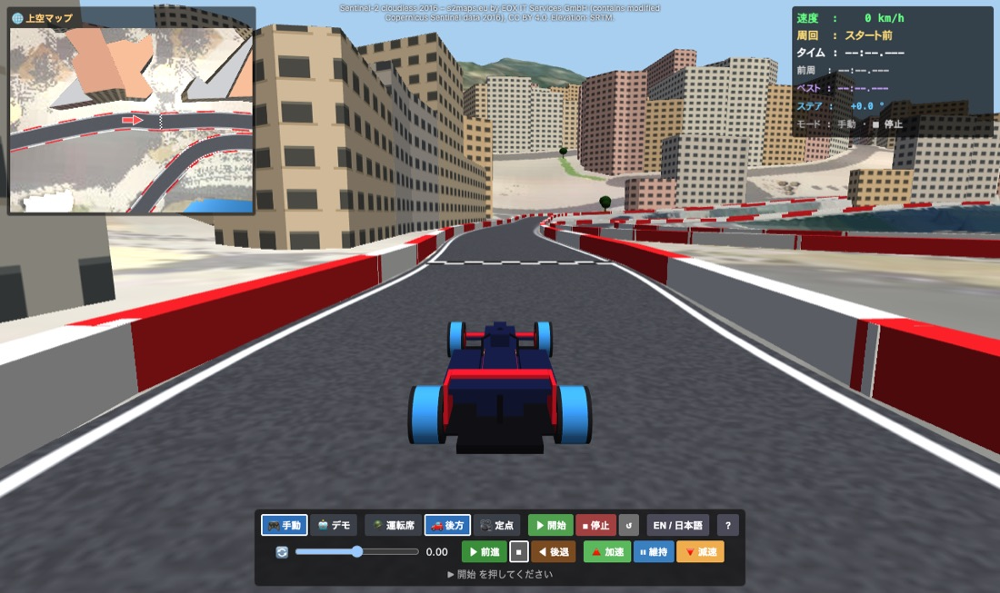
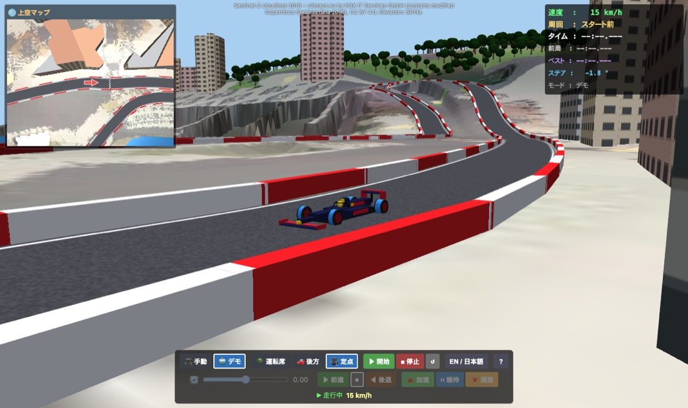
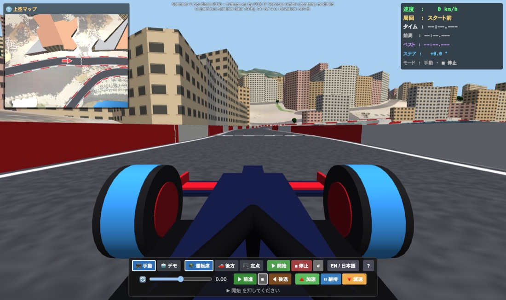

# モナコ市街地サーキット – 取扱説明書・操作マニュアル

F1 スタイルのフォーミュラカーで名門「モナコ市街地サーキット」を駆け抜けるシミュレーションアプリです。AIドライバーによる華麗なデモ走行を鑑賞することもできます。
車両のリアルな挙動計算は、高精度物理エンジン「**MuJoCo (WASM)**」がリアルタイムに実行しています。

---

## 📑 目次

1. [すぐに始める（クイックスタート）](#1-すぐに始めるクイックスタート)
2. [画面の見かた・各部名称](#2-画面の見かた各部名称)
3. [手動で運転する（マニュアルモード）](#3-手動で運転するマニュアルモード)
4. [デモ走行（自動運転モード）](#4-デモ走行自動運転モード)
5. [カメラ切り替え](#5-カメラ切り替え)
6. [ラップタイム計測](#6-ラップタイム計測)
7. [警告表示とアラート音](#7-警告表示とアラート音)
8. [キーボード操作一覧（ショートカット）](#8-キーボード操作一覧ショートカット)
9. [URLリンクオプション](#9-urlリンクオプション)
10. [困ったときは（トラブルシューティング）](#10-困ったときはトラブルシューティング)
11. [地図データとクレジット](#11-地図データとクレジット)

---

## 1. すぐに始める（クイックスタート）

### 🤖 デモ走行を見る
1. 操作パネル下の状態表示が「*▶ 開始 を押してください*」になるまで待ちます。
2. **🤖 デモ** をクリックし、続けて **▶ 開始** をクリックします。
3. **🪖 運転席**・**🚗 後方**・**🎥 定点** の3つのカメラを切り替えて臨場感ある走行をお楽しみください。

### 🎮 自分で運転する
1. **🎮 手動** が選ばれていることを確認し、**▶ 開始** をクリックします。
2. **▶ 前進** をクリックして進む向きを決めます（向きを選択するまで車は発進しません）。
3. **🔺 加速** をクリックして加速を開始します（他のペダルを押すまで加速状態が維持されます）。
4. ハンドルスライダーまたはキーボードの <kbd>←</kbd> / <kbd>→</kbd> キーでステアリング操作を行います。コーナー手前では **🔻 減速**、一定速度で走りたいときは **⏸ 維持** を使います。

---

## 2. 画面の見かた・各部名称

| 表示エリア | 説明 |
|---|---|
| **メイン画面** | ウィンドウ全体に、現在選択されているカメラ視点の3Dグラフィックを描画します。 |
| **上空マップ（左上）** | 車両周辺を上空 150 m から俯瞰したレーダーマップです。赤い矢印が自車位置と進行方向を示します。 |
| **HUD（右上）** | 速度（km/h）、周回数（Lap）、今回/前周/ベストラップタイム、前輪の実際の舵角（Steer）、現在の走行モードを表示します。手動モード時は選択中の進行方向とペダル状態も表示されます。 |
| **クレジット（上中央）** | 標高データ（SRTM）および衛星画像（Sentinel-2）の出典元表示です。 |
| **操作パネル（下）** | **上段**: 走行モード、カメラ切り替え、開始・停止・リセット、言語切替、**?**（本マニュアル）。 **下段**: 手動運転用コントロール（デモ走行時はグレーアウトして無効化）。 **ステータス行**: シミュレーションのリアルタイム稼働状態を表示。 |

---

## 3. 手動で運転する（マニュアルモード）

### 進行方向の選択

| ボタン | 動作 |
|---|---|
| **▶ 前進** | 前進モードに設定します（最高速度: 約 300 km/h）。 |
| **■** | 停止モードです。ペダルを踏んでいない場合、ブレーキをかけて完全停止します。 |
| **◀ 後退** | バック走行します（最高速度: 約 30 km/h）。ガードレールに接触して脱出する際に便利です。 |

### ペダル操作

ペダルは同時に1種類のみ選択可能です。別のペダルをクリックすると切り替わり、選択中のペダルをもう一度クリックすると解除（惰性走行/コースティング）になります。

| ペダル | 動作・効果 |
|---|---|
| **🔺 加速** | 選択した進行方向に加速します（0→100 km/h: 約3秒）。 |
| **⏸ 維持** | クルーズコントロール機能です。現在の車速をそのままキープします。 |
| **🔻 減速** | 車両を停止するまでスムーズに減速します。 |
| **（なし）** | ペダル解除状態。空気抵抗や転がり抵抗により徐々に速度が低下します。 |

### ステアリングと車速感応制御

- 🔄 スライダーをドラッグするか、キーボードの <kbd>←</kbd> / <kbd>→</kbd> キーで舵角を段階調整します。
- <kbd>C</kbd> キーを押すと瞬時にハンドルがセンター（直進）に戻ります。
- スライダーは操作した位置をキープするため、コーナー脱出後はセンターに戻してください。

> [!NOTE]
> **車速感応ステアリング制限**: 高速走行時のスピンを防ぎ安定性を確保するため、速度が上がるほど前輪の最大舵角が自動的に制限されます。
> - 100 km/h 時: 指示舵角の約 40%
> - 200 km/h 時: 指示舵角の約 15%
> - 最高速付近（300 km/h）: 指示舵角の 10% 未満
> **攻略のコツ**: コーナーを曲がるときは、必ず**手前で十分に減速してからハンドルを切る**ことが肝心です！

### モナコサーキット攻略のポイント
- サーキット全域が狭く両脇がガードレールに囲まれており、エスケープゾーン（ランオフ）がほとんどありません。
- **サント・デボート**（第1コーナー）、**カジノ・スクエア**、名物の超低速**フェアモント・ヘアピン**、トンネル直後の**ヌーヴェル・シケイン**、**ラ・ラスカス**では事前にしっかり減速してください。
- トンネル区間および港沿いの直線がアクセル全開の最高速ポイントです。
- ガードレールに引っかかった場合: **◀ 後退** を選んで **🔺 加速** でバックして体勢を立て直し、再度 **▶ 前進** に戻すか、**↺ リセット** を押してください。

---

## 4. デモ走行（自動運転モード）

**🤖 デモ** モードでは、AI オートパイロットが最適なレーシングラインと速度計画に沿って周回走行を行います。1周のラップタイムは約2分強です。

- 走行中であっても、いつでも手動モードとデモモードを相互に切り替え可能です。
- **🎮 手動** に切り替えると、その瞬間の車速を維持したままスムーズに操縦を引き継ぎます（**▶ 前進** かつ **⏸ 維持** が自動選択され、ハンドルはセンターになります）。
- 再度 **🤖 デモ** に戻すと、現在のコース位置から自動走行を再開します。

---

## 5. カメラ切り替え

| 🪖 運転席 | 🚗 後方 | 🎥 定点 |
|:---:|:---:|:---:|
|  |  |  |

| カメラ名 | 視点の特徴 |
|---|---|
| **🪖 運転席** | ドライバー目線（Halo保護バー、フロントタイヤ、サスペンションアーム、ノーズ先端）の臨場感あふれるコックピット視点です。 |
| **🚗 後方** | 車両後方上方から見下ろすチェイス視点です。周囲の状況が把握しやすく、最も運転しやすい標準ビューです。 |
| **🎥 定点** | テレビ中継風の観客視点です。コース沿い約 130 m ごとに設置されたカメラ塔が車両を追従・ズームし、通過に合わせて次のカメラへ自動スイッチします。 |

キーボードの <kbd>V</kbd> キーを押すことで、カメラを順番に切り替えられます。

---

## 6. ラップタイム計測

- 車両はチェッカー模様のスタート/フィニッシュライン直前のグリッドからスタートします（HUD表示: `Lap: grid`）。
- コントロールラインを通過すると第1ラップ（Lap 1）が開始され、タイマーが動き始めます。
- 以降、ラインを通過するたびにラップが記録され、**前周タイム（Last）** と **ベストタイム（Best）** が自動更新されます。
- ラップタイムはフレームレートの変動に影響されない物理シミュレーション時間（SIM_DT）で正確に計測されます。
- **↺ リセット** を押すと、車両が初期グリッドに戻りラップタイム記録が初期化されます。

---

## 7. 警告表示とアラート音

| 警告種類 | 発生条件 | 動作・影響 |
|---|---|---|
| **⚠ クラッシュ** | 車両がガードレールやバリアに接触したとき | 画面が赤く点滅し、3連ビープ警告音が鳴ります。接触解消から 1.5 秒後に自動解除され、走行はそのまま継続できます。 |
| **⚠ 範囲外** | コース境界の見えない外周壁に達したとき | クラッシュ警告と同様の動作です。 |
| **⚠ 転倒** | 車体が約 73° 以上傾いた状態が 0.2 秒以上継続したとき | シミュレーションが一時停止し、転倒警告が表示され続けます。**↺ リセット** を押して再開してください。 |

> [!TIP]
> ブラウザやWebViewのセキュリティ仕様により、音声はページ内操作後に有効化されます。**▶ 開始** ボタンをクリックすると自動的にアラート音が鳴るようになります。

---

## 8. キーボード操作一覧（ショートカット）

| キー | 割り当て機能 | 有効モード |
|---|---|---|
| <kbd>←</kbd> / <kbd>→</kbd> | ハンドルを左 / 右へ1段階ステア | 手動 |
| <kbd>C</kbd> | ハンドルを中央に戻す（センター復元） | 手動 |
| <kbd>F</kbd> / <kbd>S</kbd> / <kbd>R</kbd> | 前進（FWD） / 停止（Stop） / 後退（REV） | 手動 |
| <kbd>Space</kbd> または <kbd>W</kbd> | 加速（ACCEL）の ON / OFF 切替 | 手動 |
| <kbd>H</kbd> | 速度維持（HOLD）の ON / OFF 切替 | 手動 |
| <kbd>B</kbd> | 減速（BRAKE）の ON / OFF 切替 | 手動 |
| <kbd>V</kbd> | カメラ視点を切り替え（コックピット ⇄ 後方 ⇄ 定点） | 共通 |
| <kbd>M</kbd> | 走行モード切替（手動 ⇄ デモ） | 共通 |
| <kbd>L</kbd> | 表示言語切替（English ⇄ 日本語） | 共通 |

---

## 9. URLリンクオプション

URL末尾にクエリパラメータを付与することで、特定の起動状態で起動できます：

| パラメータ | 設定可能な値 | 説明 |
|---|---|---|
| `mode` | `manual` または `demo` | 初期走行モードの指定 |
| `view` | `cockpit`、`chase`、`trackside` | 初期カメラ視点の指定 |
| `lang` | `en` または `ja` | 初期表示言語の指定 |
| `autostart` | （値なし） | 読み込み完了と同時にシミュレーションを自動開始 |

**設定例**: `index.html?mode=demo&view=trackside&lang=ja&autostart`
（日本語表示・定点カメラ視点・デモ走行で即座に開始）

---

## 10. 困ったときは（トラブルシューティング）

| 症状 | 対処方法 |
|---|---|
| **「モナコを読み込み中…」で止まる** | 初回読み込み時は約 14 MB の地形・テクスチャデータをロードします。しばらくお待ちください。Web版の場合はローカルWebサーバー経由（`npm run dev`等）で開いてください。 |
| **「読み込みに失敗しました」と出る** | アプリを再読み込みしてください。エラーメッセージ末尾に読み込み失敗したファイル名が表示されます。 |
| **画面が黒い・何も描画されない** | WebGL および WebAssembly の対応が必要です。ハードウェアアクセラレーションが有効になっているかご確認ください。 |
| **描画がカクつく・動作が重い** | ウィンドウサイズを小さくするか、負荷の高いバックグラウンドアプリを終了してください。本アプリはメイン画面と上空マップの2つのビューポートを毎フレーム同時描画しています。 |
| **車が前に進まない** | 状態表示が「走行中」になっているか、**▶ 前進** が選択され、**🔺 加速** が有効かご確認ください。転倒した場合は **↺ リセット** を押してください。 |
| **高速走行時に曲がりにくい** | 車速感応ステアリングによる正常な挙動です。コーナー進入前にしっかり減速してください。 |
| **音が出ない** | **▶ 開始** ボタンをクリックしてオーディオコンテキストを起動し、システムの消音設定をご確認ください。 |

---

## 11. 地図データとクレジット

- **地形・標高データ**: SRTM 1 秒角標高データ（NASA / USGS）
- **衛星画像**: [Sentinel-2 cloudless 2016](https://s2maps.eu)（EOX IT Services GmbH, modified Copernicus Sentinel data 2016, CC BY 4.0）
- **街区・道路・サーキット形状**: モナコ市街地サーキットの公式概略図をベースにトレース。建物・樹木は軽量化のためプロシージャル生成されています。
- **物理エンジン**: [MuJoCo (Multi-Joint dynamics with Contact)](https://mujoco.org/) WebAssembly バインディング
- **3D レンダリング**: [three.js](https://threejs.org/)
- **車両モデル**: ダウンフォース・4輪独立サスペンション・車速感応ステア機構を備えた汎用フォーミュラマシンモデル。
- **実サーキットとの差分**: トレースした全長は 3,211 m（公式実測値: 3,337 m）。ラスカスやヘアピン等の超低速コーナーは物理挙動の安定化のためわずかに拡幅調整しています。
